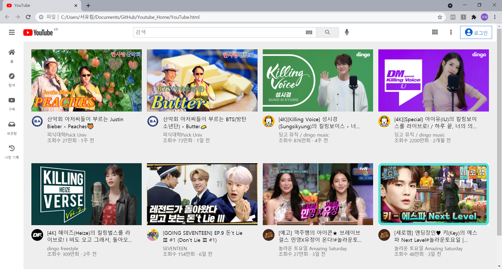

# Youtube-Clone
YouTube Main Screen

피드백
1) css
- 스타일 적용은 최대한 class로 지정
- tagName은 최대한 자제(body는 사용 가능)
- id 사용 자제
- html에서 style 속성 사용 자제

2) position 속성 남발하지 않기
- scroll 처리 고민해보기
  (어디에 overflow 속성을 넣어야지 동영상 있는 영역만 스크롤이 적용될지)
